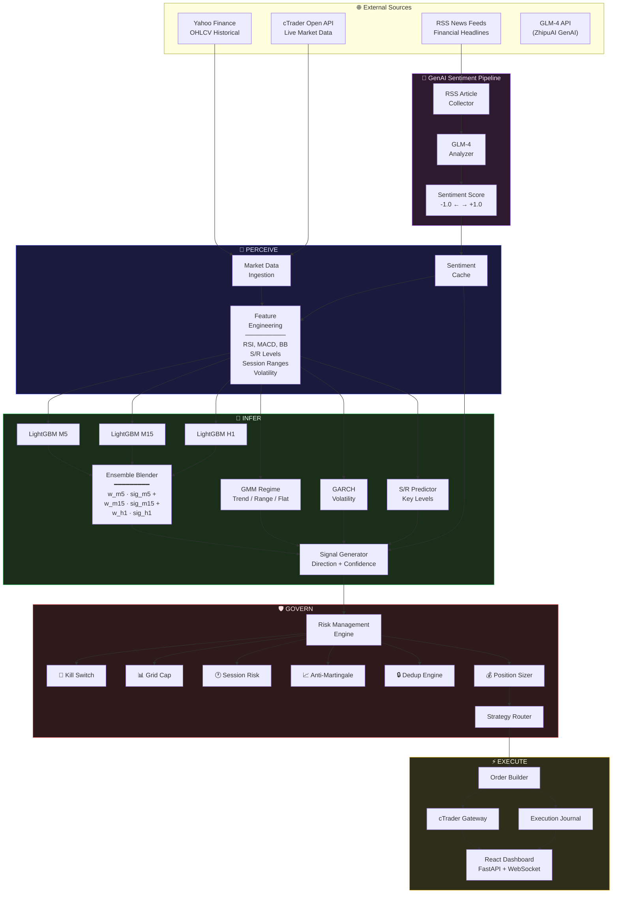
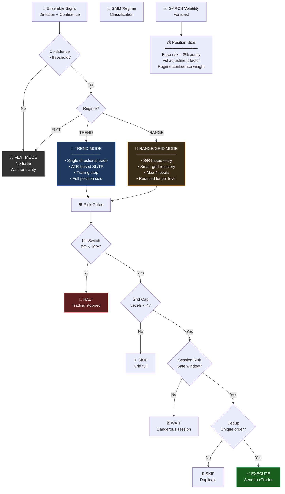
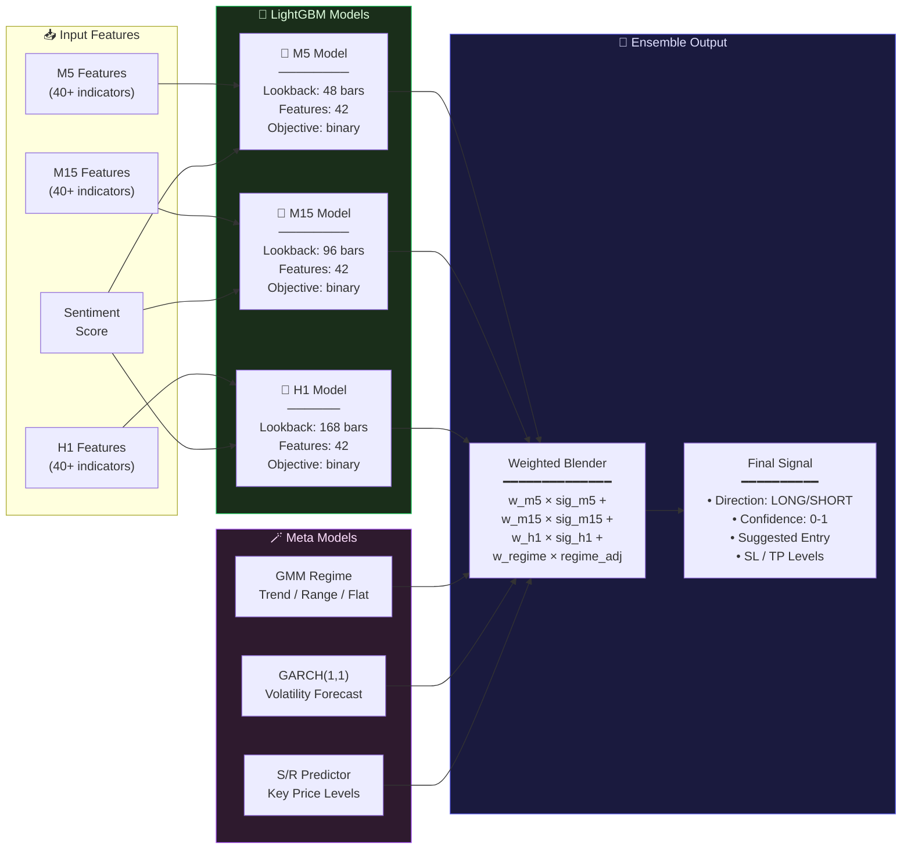

# 🏗️ Gold Trading Agent — System Architecture

> **XAU/USD ML-Driven Autonomous Trading System**
> Regime-Adaptive Execution · S/R Smart Grid · Multi-TF Ensemble · GenAI Sentiment

---

## 📐 High-Level Architecture Overview

```
┌─────────────────────────────────────────────────────────────────────────────┐
│                         🌐 EXTERNAL DATA SOURCES                            │
│   ┌──────────┐   ┌──────────────┐   ┌────────────┐   ┌──────────────────┐  │
│   │  Yahoo    │   │  RSS News    │   │  cTrader   │   │   GLM-4 API      │  │
│   │  Finance  │   │  Feeds       │   │  Open API  │   │   (ZhipuAI)      │  │
│   │  OHLCV    │   │  (Finance)   │   │  Broker    │   │   GenAI LLM      │  │
│   └─────┬─────┘   └──────┬───────┘   └─────┬──────┘   └────────┬─────────┘  │
└─────────┼────────────────┼─────────────────┼──────────────────┼─────────────┘
          │                │                 │                  │
          ▼                ▼                 │                  ▼
┌─────────────────────────────────────────┐  │   ┌──────────────────────────────┐
│         🔮 PERCEIVE LAYER               │  │   │   🤖 GenAI SENTIMENT ENGINE  │
│  ┌─────────────────────────────────┐    │  │   │                              │
│  │  Market Data Ingestion          │    │  │   │  ┌────────────────────────┐  │
│  │  • OHLCV candles (M5/M15/H1)   │    │  │   │  │  RSS Article Collector │  │
│  │  • Real-time tick stream       │    │  │   │  │  • Financial feeds     │  │
│  │  • Historical warmup buffer    │    │  │   │  │  • Gold-specific news  │  │
│  └─────────────────────────────────┘    │  │   │  └──────────┬─────────────┘  │
│  ┌─────────────────────────────────┐    │  │   │             ▼               │
│  │  Feature Engineering Pipeline   │    │  │   │  ┌────────────────────────┐  │
│  │  • TA Indicators (RSI, MACD…)  │    │  │   │  │  GLM-4 Analyzer        │  │
│  │  • S/R Level Detection         │    │  │   │  │  • Prompt engineering  │  │
│  │  • Session Ranges (Asia/London)│    │  │   │  │  • Structured JSON out │  │
│  │  • Sentiment Score (from GenAI)│◄───┼──┼───┤  │   • Confidence scoring │  │
│  └─────────────────────────────────┘    │  │   │  └──────────┬─────────────┘  │
│  ┌─────────────────────────────────┐    │  │   │             ▼               │
│  │  Order Book / Position Snapshot │    │  │   │  ┌────────────────────────┐  │
│  │  • Open positions               │    │  │   │  │  Sentiment Score       │  │
│  │  • Pending orders               │    │  │   │  │  • -1.0 to +1.0       │  │
│  │  • Account equity / margin      │    │  │   │  │  • Feature + Filter    │  │
│  └─────────────────────────────────┘    │  │   │  └────────────────────────┘  │
└─────────────────────────────────────────┘  │   └──────────────────────────────┘
                                              │
          ┌───────────────────────────────────┘
          │
          ▼
┌─────────────────────────────────────────────────────────────────────────────┐
│                          🧠 INFER LAYER                                     │
│                                                                              │
│  ┌──────────────────┐  ┌──────────────────┐  ┌──────────────────────────┐   │
│  │  📊 ML Models    │  │  🔄 Regime       │  │  🎯 Signal Generator     │   │
│  │                  │  │  Detection       │  │                          │   │
│  │  ┌────────────┐  │  │                  │  │  • Direction (LONG/SHORT)│   │
│  │  │ LightGBM   │  │  │  ┌────────────┐  │  │  • Entry price          │   │
│  │  │ M5 → Sig   │  │  │  │ GMM        │  │  │  • Stop loss            │   │
│  │  ├────────────┤  │  │  │ 3-state    │  │  │  • Take profit          │   │
│  │  │ LightGBM   │  │  │  │ Trend/Rng/ │  │  │  • Confidence [0-1]     │   │
│  │  │ M15 → Sig  │  │  │  │ Flat       │  │  │  • Mode flag            │   │
│  │  ├────────────┤  │  │  └────────────┘  │  └───────────┬──────────────┘   │
│  │  │ LightGBM   │  │  │  ┌────────────┐  │              │                  │
│  │  │ H1 → Sig   │  │  │  │ GARCH      │  │              │                  │
│  │  └─────┬──────┘  │  │  │ Volatility │  │              │                  │
│  │        ▼         │  │  └────────────┘  │              │                  │
│  │  ┌────────────┐  │  │  ┌────────────┐  │              │                  │
│  │  │ Ensemble   │  │  │  │ S/R        │  │              │                  │
│  │  │ Blender    │  │  │  │ Predictor  │  │              │                  │
│  │  │ (weighted) │  │  │  │ (levels)   │  │              │                  │
│  │  └────────────┘  │  │  └────────────┘  │              │                  │
│  └──────────────────┘  └──────────────────┘              │                  │
│                                                           │                  │
└───────────────────────────────────────────────────────────┼──────────────────┘
                                                            │
                                                            ▼
┌─────────────────────────────────────────────────────────────────────────────┐
│                          🛡️ GOVERN LAYER                                    │
│                                                                              │
│  ┌─────────────────────────────────────────────────────────────────────┐    │
│  │                     Risk Management Engine                          │    │
│  │                                                                     │    │
│  │  ┌──────────────┐  ┌──────────────┐  ┌──────────────┐              │    │
│  │  │  🚨 Kill     │  │  📊 Grid     │  │  🕐 Session  │              │    │
│  │  │  Switch      │  │  Cap         │  │  Risk        │              │    │
│  │  │  Max DD 10%  │  │  Max 4 lvl  │  │  NFP/FOMC   │              │    │
│  │  └──────────────┘  └──────────────┘  └──────────────┘              │    │
│  │                                                                     │    │
│  │  ┌──────────────┐  ┌──────────────┐  ┌──────────────┐              │    │
│  │  │  📈 Anti-    │  │  🔒 Dedup    │  │  💰 Size     │              │    │
│  │  │  Martingale  │  │  Engine      │  │  Calculator  │              │    │
│  │  │  Reduce lot  │  │  No dup ord  │  │  Risk-based  │              │    │
│  │  └──────────────┘  └──────────────┘  └──────────────┘              │    │
│  └─────────────────────────────────────────────────────────────────────┘    │
│                                                                              │
│  ┌─────────────────────────────────────────────────────────────────────┐    │
│  │                     Strategy Router                                 │    │
│  │                                                                     │    │
│  │     ┌───────────┐      ┌───────────────┐      ┌───────────┐       │    │
│  │     │  TREND    │      │  RANGE/GRID   │      │   FLAT    │       │    │
│  │     │  MODE     │      │  MODE         │      │   MODE    │       │    │
│  │     │           │      │               │      │           │       │    │
│  │     │ Single    │      │ S/R Grid      │      │ No trade  │       │    │
│  │     │ direction │      │ Recovery      │      │ Wait      │       │    │
│  │     │ trade     │      │ Smart levels  │      │ signal    │       │    │
│  │     └───────────┘      └───────────────┘      └───────────┘       │    │
│  └─────────────────────────────────────────────────────────────────────┘    │
│                                                                              │
└─────────────────────────────────────────────────────────────────────────────┘
                                                            │
                                                            ▼
┌─────────────────────────────────────────────────────────────────────────────┐
│                          ⚡ EXECUTE LAYER                                    │
│                                                                              │
│  ┌────────────────────────────┐      ┌────────────────────────────────────┐ │
│  │  📋 Order Builder          │      │  🔌 cTrader Gateway                │ │
│  │                            │      │                                    │ │
│  │  • Market / Limit orders   │─────▶│  • Open API 2.0 (gRPC/REST)       │ │
│  │  • SL / TP attachment      │      │  • SSL/TLS mutual auth            │ │
│  │  • Grid level placement    │      │  • Order submission & tracking    │ │
│  │  • Partial close logic     │      │  • Position synchronization       │ │
│  └────────────────────────────┘      └────────────────────────────────────┘ │
│                                                                              │
│  ┌────────────────────────────┐      ┌────────────────────────────────────┐ │
│  │  📝 Execution Journal      │      │  📊 Real-time Dashboard            │ │
│  │                            │      │                                    │ │
│  │  • Trade log (JSON)        │      │  • React + FastAPI + WebSocket     │ │
│  │  • Reasoning trace         │      │  • Signal / Sentiment / Risk       │ │
│  │  • P&L tracking            │      │  • Regime / Agent Loop / Backtest  │ │
│  └────────────────────────────┘      └────────────────────────────────────┘ │
│                                                                              │
└─────────────────────────────────────────────────────────────────────────────┘
```

---

## 🗂️ Component Breakdown

### 📂 Project Structure

```
trading-agent/
├── 📁 config/
│   ├── settings.py              # Central configuration (pydantic BaseSettings)
│   ├── trading_params.yaml      # Instrument, lot sizes, risk params
│   └── model_config.yaml        # Model paths, feature lists, thresholds
│
├── 📁 data/
│   ├── providers/
│   │   ├── yahoo_provider.py    # Yahoo Finance OHLCV download
│   │   ├── rss_provider.py      # RSS news feed collector
│   │   └── ctrader_provider.py  # cTrader live market data
│   └── feature_engine.py        # TA indicators, S/R, session features
│
├── 📁 models/
│   ├── lgbm_m5.py               # LightGBM M5 timeframe model
│   ├── lgbm_m15.py              # LightGBM M15 timeframe model
│   ├── lgbm_h1.py               # LightGBM H1 timeframe model
│   ├── gmm_regime.py            # Gaussian Mixture Model regime detector
│   ├── garch_vol.py             # GARCH volatility forecaster
│   ├── sr_predictor.py          # Support/Resistance level predictor
│   └── ensemble_blender.py      # Weighted ensemble of all model signals
│
├── 📁 sentiment/
│   ├── rss_collector.py         # Multi-source RSS feed aggregation
│   ├── glm4_analyzer.py         # GLM-4 API integration for sentiment
│   ├── prompt_templates.py      # Structured prompts for financial analysis
│   └── sentiment_cache.py       # TTL cache for sentiment scores
│
├── 📁 strategy/
│   ├── strategy_router.py       # Regime-based strategy selection
│   ├── trend_strategy.py        # Trend-following execution logic
│   ├── range_grid_strategy.py   # S/R-based smart grid recovery
│   └── flat_strategy.py         # No-trade / wait mode
│
├── 📁 risk/
│   ├── kill_switch.py           # Maximum drawdown circuit breaker
│   ├── grid_cap.py              # Maximum grid level enforcement
│   ├── session_risk.py          # News event / session risk filter
│   ├── anti_martingale.py       # Position sizing after loss
│   ├── dedup_engine.py          # Duplicate order prevention
│   └── position_sizer.py        # Risk-based lot size calculation
│
├── 📁 execution/
│   ├── ctrader_gateway.py       # cTrader Open API 2.0 client
│   ├── order_builder.py         # Order construction & validation
│   └── execution_journal.py     # Trade logging & reasoning trace
│
├── 📁 api/
│   ├── main.py                  # FastAPI application entry point
│   ├── websocket_manager.py     # WebSocket connection hub
│   └── routes/
│       ├── signal_routes.py     # Signal & prediction endpoints
│       ├── sentiment_routes.py  # Sentiment analysis endpoints
│       ├── risk_routes.py       # Risk status endpoints
│       ├── regime_routes.py     # Regime detection endpoints
│       ├── backtest_routes.py   # Backtesting result endpoints
│       └── config_routes.py     # Configuration endpoints
│
├── 📁 dashboard/
│   ├── package.json             # React dependencies
│   ├── src/
│   │   ├── App.jsx              # Main dashboard layout (8 panels)
│   │   ├── hooks/
│   │   │   └── useWebSocket.js  # WebSocket hook for real-time data
│   │   ├── panels/
│   │   │   ├── SignalPanel.jsx
│   │   │   ├── SentimentPanel.jsx
│   │   │   ├── RiskPanel.jsx
│   │   │   ├── RegimePanel.jsx
│   │   │   ├── AgentLoopPanel.jsx
│   │   │   ├── BacktestPanel.jsx
│   │   │   └── ConfigPanel.jsx
│   │   └── components/
│   │       ├── GaugeChart.jsx
│   │       ├── CandlestickChart.jsx
│   │       ├── RegimeIndicator.jsx
│   │       └── SentimentBadge.jsx
│   └── vite.config.js
│
├── 📁 agent/
│   └── trading_loop.py          # Main autonomous agent loop (PERCEIVE→INFER→GOVERN→EXECUTE)
│
├── 📁 tests/
│   ├── test_feature_engine.py
│   ├── test_ensemble.py
│   ├── test_risk_gates.py
│   ├── test_sentiment.py
│   └── test_strategy_router.py
│
├── .env.example                 # API keys template (GLM-4, cTrader)
├── requirements.txt             # Python dependencies
└── README.md
```

---

### 🔧 Component Details

| Component | Module | Responsibility | Key Technology |
|-----------|--------|----------------|----------------|
| 📊 **Market Data Provider** | `data/providers/` | OHLCV ingestion from Yahoo Finance + cTrader | `yfinance`, `asyncio` |
| 📰 **News Collector** | `sentiment/rss_collector.py` | RSS feed aggregation from financial sources | `feedparser`, `aiohttp` |
| 🤖 **Sentiment Engine** | `sentiment/glm4_analyzer.py` | GLM-4 powered news sentiment analysis | `ZhipuAI API`, `pydantic` |
| 🧮 **Feature Engine** | `data/feature_engine.py` | Technical indicators, S/R, session features | `pandas-ta`, `numpy` |
| 🌳 **LightGBM Models** | `models/lgbm_*.py` | Per-timeframe price direction prediction | `lightgbm`, `sklearn` |
| 🎯 **GMM Regime** | `models/gmm_regime.py` | Market regime classification (Trend/Range/Flat) | `sklearn.mixture` |
| 📈 **GARCH Volatility** | `models/garch_vol.py` | Volatility forecasting for position sizing | `arch`, `statsmodels` |
| 🔺 **S/R Predictor** | `models/sr_predictor.py` | Support/Resistance level identification | custom algorithm |
| 🪄 **Ensemble Blender** | `models/ensemble_blender.py` | Weighted multi-model signal fusion | `numpy`, `scipy` |
| 🛡️ **Risk Engine** | `risk/` | All risk gates & position sizing | Custom rules engine |
| 🔀 **Strategy Router** | `strategy/strategy_router.py` | Regime-based strategy dispatch | State machine |
| 🔌 **cTrader Gateway** | `execution/ctrader_gateway.py` | Broker connectivity & order management | `ctrader-open-api` |
| 🖥️ **API Server** | `api/` | REST + WebSocket endpoints | `FastAPI`, `uvicorn` |
| 📊 **Dashboard** | `dashboard/` | Real-time monitoring UI | `React`, `Vite`, `recharts` |

---

## 🔄 Data Flow Diagrams

### Complete System Data Flow



### GenAI Sentiment Analysis Flow (Detail)

```mermaid
sequenceDiagram
    participant Loop as Agent Loop
    participant RSS as RSS Collector
    participant GLM as GLM-4 API
    participant Cache as Sentiment Cache
    participant FE as Feature Engine
    participant SG as Signal Generator

    Loop->>RSS: Fetch latest gold news
    RSS->>RSS: Parse feeds (FT, Reuters, Bloomberg)
    RSS-->>Loop: Raw articles (title + summary)

    Loop->>GLM: Analyze sentiment (batch)
    Note over GLM: Prompt: Financial sentiment<br/>Output: JSON {score, confidence, themes}
    GLM-->>Loop: Sentiment response

    Loop->>Cache: Store score (TTL = 30 min)
    Note over Cache: Key: article_hash<br/>Value: {score, confidence}

    Loop->>Cache: Get current sentiment
    Cache-->>FE: Cached sentiment score

    FE->>FE: Merge into feature vector
    Note over FE: sentiment_score ∈ [-1, +1]<br/>sentiment_confidence ∈ [0, 1]

    FE->>SG: Complete feature matrix
    Note over SG: Sentiment as:<br/>• Feature (model input)<br/>• Filter (block if |score| < threshold)
```

### Strategy Router Decision Tree



### WebSocket Real-Time Update Flow

```mermaid
sequenceDiagram
    participant Loop as Trading Loop
    participant API as FastAPI Server
    participant WS as WebSocket Hub
    participant Client as React Dashboard

    loop Every Cycle (5 min)
        Loop->>API: POST /internal/cycle-result
        Note over API: {signal, regime, risk_state,<br/>sentiment, positions, pnl}
        API->>WS: Broadcast update
        WS-->>Client: JSON via WebSocket
        Client->>Client: Update all 8 panels
    end

    Client->>API: GET /api/backtest/results
    API-->>Client: Historical performance data

    Client->>API: GET /api/config/current
    API-->>Client: Current configuration state
```

---

## 📚 ML4T Curriculum Mapping

> How each component maps to the **Machine Learning for Trading (ML4T)** curriculum topics

| # | ML4T Topic | 🎯 System Component | Implementation | Learning Objective |
|---|-----------|----------------------|----------------|--------------------|
| 1 | **Building an ML-based Trading System** | `agent/trading_loop.py` | Full PERCEIVE→INFER→GOVERN→EXECUTE loop | End-to-end system design |
| 2 | **Data Ingestion & Feature Engineering** | `data/feature_engine.py` | 40+ TA features, S/R levels, session ranges | Feature pipeline architecture |
| 3 | **Time Series Cross-Validation** | Model training scripts | Purged K-Fold with embargo | Robust backtesting methodology |
| 4 | **Tree-Based Models (Random Forest / GBM)** | `models/lgbm_*.py` | LightGBM with custom objective functions | Ensemble learning for finance |
| 5 | **Feature Importance & Selection** | `models/ensemble_blender.py` | SHAP values, permutation importance | Model interpretability |
| 6 | **Regime Detection (Clustering)** | `models/gmm_regime.py` | 3-state Gaussian Mixture Model | Unsupervised learning for markets |
| 7 | **Volatility Modeling** | `models/garch_vol.py` | GARCH(1,1) volatility forecasting | Econometric models in trading |
| 8 | **Risk Management** | `risk/` (all modules) | Kill switch, grid cap, anti-martingale | Position sizing & capital protection |
| 9 | **Strategy Backtesting** | `api/routes/backtest_routes.py` | Vectorized + event-driven backtesting | Performance attribution |
| 10 | **Execution & Order Management** | `execution/ctrader_gateway.py` | cTrader Open API integration | Real-world order execution |
| 11 | **NLP / Sentiment Analysis** | `sentiment/glm4_analyzer.py` | GLM-4 GenAPI for financial news | LLM integration in trading |
| 12 | **Dashboard & Visualization** | `dashboard/` | React + FastAPI + WebSocket | Real-time monitoring systems |
| 13 | **MLOps & Model Governance** | `config/`, versioning | YAML configs, model versioning | Production ML system management |

---

## 🛡️ Risk Controls Summary

### Control Matrix

| Control | Module | Trigger | Action | Priority |
|---------|--------|---------|--------|----------|
| 🚨 **Kill Switch** | `risk/kill_switch.py` | Drawdown ≥ 10% of equity | Halt all trading, cancel pending orders | **P0 — Critical** |
| 📊 **Grid Cap** | `risk/grid_cap.py` | Grid levels ≥ 4 | Block new grid entries | **P0 — Critical** |
| 🕐 **Session Risk** | `risk/session_risk.py` | NFP, FOMC, high-impact events | Reduce size or skip trade | **P1 — High** |
| 📈 **Anti-Martingale** | `risk/anti_martingale.py` | Consecutive losses | Reduce lot size by 50% | **P1 — High** |
| 🔒 **Dedup Engine** | `risk/dedup_engine.py` | Duplicate signal within cooldown | Skip redundant order | **P2 — Medium** |
| 💰 **Position Sizer** | `risk/position_sizer.py` | Every trade request | Risk ≤ 2% equity per trade | **P1 — High** |
| 🔄 **Regime Gate** | `strategy/strategy_router.py` | Flat regime detected | Force no-trade mode | **P1 — High** |
| 🤖 **Sentiment Filter** | `sentiment/glm4_analyzer.py` | Low confidence sentiment | Reduce weight or skip | **P2 — Medium** |

### Risk Flow

```
                    Incoming Signal
                          │
                          ▼
                ┌─────────────────┐
                │  🚨 Kill Switch  │──── DD ≥ 10%? ──→ ❌ HALT ALL
                └────────┬────────┘
                         │ Pass
                         ▼
                ┌─────────────────┐
                │  📊 Grid Cap     │──── Levels ≥ 4? ──→ ❌ SKIP
                └────────┬────────┘
                         │ Pass
                         ▼
                ┌─────────────────┐
                │  🕐 Session Risk │──── High-impact? ──→ ⚠️ REDUCE/WAIT
                └────────┬────────┘
                         │ Pass
                         ▼
                ┌─────────────────┐
                │  📈 Anti-Mart    │──── Consec loss? ──→ 📉 HALF SIZE
                └────────┬────────┘
                         │ Pass
                         ▼
                ┌─────────────────┐
                │  🔒 Dedup Check  │──── Duplicate? ──→ ❌ SKIP
                └────────┬────────┘
                         │ Pass
                         ▼
                ┌─────────────────┐
                │  💰 Size Calc    │──── Risk% / (SL × pip_val)
                └────────┬────────┘
                         │
                         ▼
                    ✅ APPROVED
```

---

## 🛠️ Technology Stack

### Backend

| Layer | Technology | Version | Purpose |
|-------|-----------|---------|---------|
| 🐍 **Language** | Python | 3.11+ | Core runtime |
| 🌐 **API Framework** | FastAPI | 0.104+ | REST + WebSocket server |
| 🔌 **WebSocket** | FastAPI WebSocket | — | Real-time push to dashboard |
| 🌳 **ML Core** | LightGBM | 4.1+ | Gradient boosting models |
| 📊 **ML Utils** | scikit-learn | 1.3+ | GMM, metrics, preprocessing |
| 📈 **Econometrics** | arch | 6.1+ | GARCH volatility model |
| 📉 **TA Library** | pandas-ta | 0.3.14b | Technical analysis indicators |
| 📰 **RSS Parser** | feedparser | 6.0+ | News feed ingestion |
| 🤖 **GenAI SDK** | zhipuai | 2.0+ | GLM-4 API client |
| 💹 **Broker API** | ctrader-open-api | 2.x | cTrader integration |
| 📊 **Data** | pandas / numpy | latest | Data manipulation |
| ✅ **Validation** | pydantic | 2.0+ | Schema validation |
| 🧪 **Testing** | pytest | 7.4+ | Unit & integration tests |
| 📝 **Logging** | loguru | 0.7+ | Structured logging |

### Frontend

| Layer | Technology | Version | Purpose |
|-------|-----------|---------|---------|
| ⚛️ **Framework** | React | 18+ | UI components |
| 🔀 **Build Tool** | Vite | 5.0+ | Fast dev server & bundler |
| 📊 **Charts** | Recharts | 2.10+ | Data visualization |
| 🎨 **Styling** | Tailwind CSS | 3.3+ | Utility-first CSS |
| 🔌 **WebSocket** | Native WebSocket API | — | Real-time data feed |

### Infrastructure

| Layer | Technology | Purpose |
|-------|-----------|---------|
| 🔐 **Secrets** | `.env` + `python-dotenv` | API key management |
| 📦 **Package Mgr** | `pip` + `requirements.txt` | Python dependencies |
| 📦 **Package Mgr** | `npm` | Node.js dependencies |
| 🔄 **Process** | `uvicorn` | ASGI server |
| 📊 **Monitoring** | Custom dashboard | System health & P&L |

---

## 📊 Model Architecture Detail

### Multi-Timeframe Ensemble



### Feature Engineering Pipeline

| Feature Category | Count | Examples | Source |
|-----------------|-------|----------|--------|
| 📈 **Trend** | 8 | SMA(10/20/50), EMA, ADX, Ichimoku | OHLCV |
| 📊 **Momentum** | 10 | RSI(14), MACD, Stochastic, CCI, Williams %R | OHLCV |
| 📉 **Volatility** | 8 | Bollinger Bands, ATR, Keltner, Donchian | OHLCV |
| 📦 **Volume** | 4 | OBV, VWAP, Volume SMA, CMF | OHLCV + Volume |
| 🔺 **S/R Levels** | 5 | Nearest support, resistance, distance, strength | S/R Predictor |
| 🕐 **Session** | 4 | Asia range, London range, NY overlap, hour encoding | Timestamp |
| 🤖 **Sentiment** | 3 | Score, confidence, trend (Δ score) | GLM-4 Analysis |
| **Total** | **~42** | | |

---

## 🔗 API Endpoints

| Method | Endpoint | Description |
|--------|----------|-------------|
| `GET` | `/api/signal/current` | Current trading signal |
| `GET` | `/api/signal/history` | Signal history (paginated) |
| `GET` | `/api/sentiment/current` | Latest sentiment score |
| `GET` | `/api/sentiment/articles` | Analyzed news articles |
| `GET` | `/api/risk/status` | Risk engine state |
| `GET` | `/api/risk/positions` | Open positions summary |
| `GET` | `/api/regime/current` | Current market regime |
| `GET` | `/api/regime/history` | Regime history |
| `GET` | `/api/agent/status` | Agent loop status |
| `GET` | `/api/agent/cycle-log` | Cycle execution log |
| `GET` | `/api/backtest/results` | Backtesting results |
| `GET` | `/api/config/current` | Current configuration |
| `PUT` | `/api/config/update` | Update configuration |
| `WS` | `/ws` | Real-time updates stream |

---

## 🏁 System Constraints & Defaults

| Parameter | Default Value | Description |
|-----------|--------------|-------------|
| **Symbol** | XAUUSD | Gold vs US Dollar |
| **Cycle Interval** | 5 minutes | Agent loop frequency |
| **Max Drawdown** | 10% | Kill switch threshold |
| **Risk Per Trade** | 2% | Position sizing basis |
| **Max Grid Levels** | 4 | Grid recovery cap |
| **Ensemble Threshold** | 0.65 | Minimum confidence to trade |
| **Sentiment TTL** | 30 min | Cache expiry for sentiment |
| **GMM States** | 3 | Trend / Range / Flat |
| **GARCH Order** | (1,1) | Standard GARCH config |
| **Warmup Bars** | 200 | Minimum bars before trading |

---

> **Built with ❤️ for the ML4T Capstone Project**
> _Demonstrating the intersection of Machine Learning, GenAI, and Algorithmic Trading_