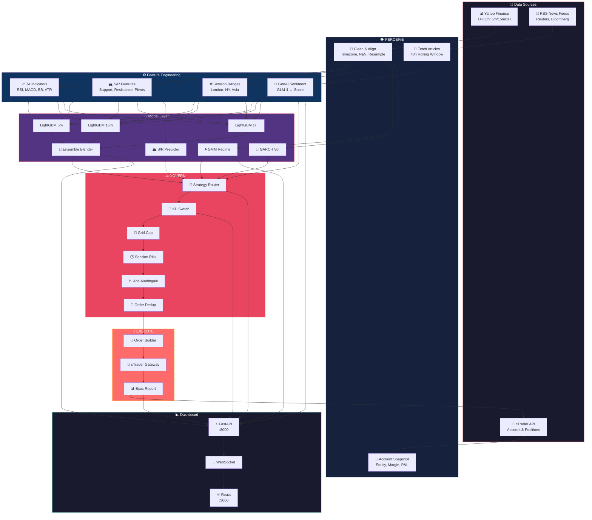

# 🔄 Gold Trading Agent — Complete System Loop

> **XAU/USD ML-Driven Autonomous Trading System**
> Regime-Adaptive Execution · S/R Smart Grid Recovery · Multi-TF Ensemble · GenAI Sentiment

---

## 🧭 Table of Contents

1. [Autonomous Agent Loop](#-autonomous-agent-loop)
2. [Data Ingestion Layer](#-data-ingestion-layer)
3. [Feature Engineering Pipeline](#-feature-engineering-pipeline)
4. [Model Layer](#-model-layer)
5. [Strategy Router](#-strategy-router)
6. [Risk Governor](#-risk-governor)
7. [Execution Gateway](#-execution-gateway)
8. [GenAI In The Loop](#-genai-in-the-loop)
9. [Real-Time Dashboard](#-real-time-dashboard)
10. [Full Data-Flow Diagram](#-full-data-flow-diagram)

---

## 🔄 Autonomous Agent Loop

The agent operates as a continuous **PERCEIVE → INFER → GOVERN → EXECUTE** cycle,
running every tick (or on-demand via the dashboard).

```
┌──────────────────────────────────────────────────────────────────────────────┐
│                                                                              │
│                     🤖  GOLD TRADING AGENT LOOP                              │
│                                                                              │
│    ┌──────────┐      ┌──────────┐      ┌──────────┐      ┌──────────┐       │
│    │          │      │          │      │          │      │          │       │
│    │  👁 PER-  │─────▶│  🧠 IN-  │─────▶│  ⚖️ GOV-  │─────▶│  ⚡ EXE-  │       │
│    │  CEIVE   │      │  FER     │      │  ERN     │      │  CUTE    │       │
│    │          │      │          │      │          │      │          │       │
│    └──────────┘      └──────────┘      └──────────┘      └──────────┘       │
│         ▲                                                         │          │
│         │                                                         │          │
│         └───────────────── FEEDBACK ◀────────────────────────────┘          │
│                                                                              │
└──────────────────────────────────────────────────────────────────────────────┘
```

### Phase Details

| Phase | Icon | Responsibility | Key Outputs |
|-------|------|----------------|-------------|
| **PERCEIVE** | 👁 | Collect & clean market data | OHLCV bars, news articles, account state |
| **INFER** | 🧠 | Generate predictions & regime | Signal, sentiment score, regime label, vol forecast |
| **GOVERN** | ⚖️ | Risk checks & strategy routing | Approved/rejected signal, position sizing, mode |
| **EXECUTE** | ⚡ | Send orders to broker | Placed trades, grid legs, stop/limit orders |

---

## 📥 Data Ingestion Layer

```
                         ┌─────────────────────────────┐
                         │     📡 DATA SOURCES          │
                         └──────────┬──────────────────┘
                                    │
              ┌─────────────────────┼─────────────────────┐
              │                     │                     │
              ▼                     ▼                     ▼
   ┌─────────────────┐  ┌─────────────────┐  ┌─────────────────┐
   │  📊 Yahoo Finance│  │  📰 RSS News    │  │  🔌 cTrader API │
   │                 │  │    Feeds        │  │                 │
   │  • XAUUSD OHLCV │  │  • Reuters      │  │  • Account info │
   │  • 5m / 15m /   │  │  • Bloomberg    │  │  • Open trades  │
   │    1H / 4H / 1D │  │  • ForexLive    │  │  • Margins      │
   │  • Volume       │  │  • Gold-specific│  │  • P&L          │
   └────────┬────────┘  └────────┬────────┘  └────────┬────────┘
            │                    │                     │
            ▼                    ▼                     ▼
   ┌─────────────────┐  ┌─────────────────┐  ┌─────────────────┐
   │  Clean & Align  │  │  Raw Articles   │  │  Position State │
   │  • Timezone UTC │  │  • Title + Body │  │  • Floating P/L │
   │  • Fill NaNs    │  │  • Timestamp    │  │  • Margin level │
   │  • Resample TFs │  │  • Source tag   │  │  • Order book   │
   └─────────────────┘  └─────────────────┘  └─────────────────┘
```

| Source | Refresh Rate | Format | Storage |
|--------|-------------|--------|---------|
| Yahoo Finance OHLCV | Every 5 min | Pandas DataFrame | In-memory cache |
| RSS News Feeds | Every 15 min | List[Article] | Rolling window (48h) |
| cTrader API | Real-time (WebSocket) | JSON via protobuf | Live session state |

---

## ⚙️ Feature Engineering Pipeline

```
┌──────────────────────────────────────────────────────────────────────────────┐
│                          ⚙️  FEATURE ENGINEERING                             │
│                                                                              │
│  ┌───────────────────┐  ┌───────────────────┐  ┌───────────────────┐        │
│  │ 📈 TA Indicators   │  │ 🏔 S/R Features    │  │ 🌐 Session Ranges │        │
│  │                   │  │                   │  │                   │        │
│  │ • SMA 20/50/200   │  │ • Nearest support │  │ • London range    │        │
│  │ • EMA 12/26       │  │ • Nearest resist. │  │ • NY range        │        │
│  │ • RSI (14)        │  │ • S/R strength    │  │ • Asia range      │        │
│  │ • MACD            │  │ • Breakout dist   │  │ • Session overlap  │        │
│  │ • Bollinger Bands │  │ • Pivot levels    │  │ • High/low of day │        │
│  │ • ATR (14)        │  │ • Demand zones    │  │ • Day of week     │        │
│  │ • Stochastic      │  │ • Supply zones    │  │ • Hour sin/cos    │        │
│  │ • ADX             │  │                   │  │                   │        │
│  └───────────────────┘  └───────────────────┘  └───────────────────┘        │
│           │                      │                      │                   │
│           └──────────────────────┼──────────────────────┘                   │
│                                  │                                          │
│                                  ▼                                          │
│                    ┌─────────────────────────┐                               │
│                    │   🧪 GenAI Sentiment     │                               │
│                    │                         │                               │
│                    │  • Composite score [-1,1]│                               │
│                    │  • Bullish / Bearish flag│                               │
│                    │  • Key topics extracted  │                               │
│                    │  • Fed policy signal     │                               │
│                    │  • Geopolitical risk idx │                               │
│                    └─────────────────────────┘                               │
│                                  │                                          │
│                                  ▼                                          │
│                    ┌─────────────────────────┐                               │
│                    │  📦 FEATURE VECTOR       │                               │
│                    │  shape: (N, ~120 feats) │                               │
│                    └─────────────────────────┘                               │
└──────────────────────────────────────────────────────────────────────────────┘
```

### Feature Groups Summary

| Group | Count | Example Features |
|-------|-------|-----------------|
| 📈 TA Indicators | ~45 | `rsi_14`, `macd_hist`, `bb_pct`, `atr_14`, `adx_20` |
| 🏔 S/R Features | ~25 | `dist_nearest_support`, `sr_strength`, `pivot_r1` |
| 🌐 Session | ~20 | `london_range`, `ny_session_pct`, `hour_sin`, `dow_mon` |
| 🧪 Sentiment | ~10 | `sentiment_composite`, `fed_hawk_dove`, `geo_risk_score` |
| 📊 Lag / Diff | ~20 | `return_1`, `return_5`, `vol_diff`, `rsi_delta` |

---

## 🧠 Model Layer

```
┌──────────────────────────────────────────────────────────────────────────────┐
│                              🧠  MODEL LAYER                                │
│                                                                              │
│   ┌─────────────────────────────────────────────────────────────────────┐    │
│   │                    ⏱ MULTI-TIMEFRAME LightGBM                      │    │
│   │                                                                     │    │
│   │   ┌─────────────┐   ┌─────────────┐   ┌─────────────┐             │    │
│   │   │  5-Min Model │   │ 15-Min Model│   │  1-Hour Model│             │    │
│   │   │             │   │             │   │             │              │    │
│   │   │ p_up  p_dn  │   │ p_up  p_dn  │   │ p_up  p_dn  │             │    │
│   │   │ signal_5m   │   │ signal_15m  │   │ signal_1h   │             │    │
│   │   └──────┬──────┘   └──────┬──────┘   └──────┬──────┘             │    │
│   │          │                 │                 │                     │    │
│   │          └─────────────────┼─────────────────┘                     │    │
│   │                            ▼                                       │    │
│   │                ┌─────────────────────┐                             │    │
│   │                │ 🎯 Ensemble Blender  │                             │    │
│   │                │  Weighted average    │                             │    │
│   │                │  w=[0.2, 0.3, 0.5]   │                             │    │
│   │                │  → final_signal      │                             │    │
│   │                └──────────┬──────────┘                             │    │
│   └───────────────────────────┼───────────────────────────────────────┘    │
│                                │                                            │
│         ┌──────────────────────┼──────────────────────┐                    │
│         │                      │                      │                    │
│         ▼                      ▼                      ▼                    │
│  ┌──────────────┐    ┌──────────────┐    ┌──────────────┐                 │
│  │ 🌀 GMM Regime │    │ 📏 GARCH Vol  │    │ 🏔 S/R Predict│                 │
│  │              │    │              │    │              │                  │
│  │ Trending ▲  │    │ σ forecast   │    │ Next support │                  │
│  │ Ranging  ═  │    │ Vol cluster  │    │ Next resist. │                  │
│  │ Volatile ⚡ │    │ Vol regime   │    │ Bounce prob  │                  │
│  └──────────────┘    └──────────────┘    └──────────────┘                 │
│         │                    │                     │                       │
│         └────────────────────┼─────────────────────┘                       │
│                              ▼                                              │
│                ┌──────────────────────────┐                                │
│                │  📋 UNIFIED MARKET VIEW   │                                │
│                │                          │                                │
│                │  signal: +0.65 (BUY)     │                                │
│                │  regime: TRENDING_UP     │                                │
│                │  vol:     MEDIUM         │                                │
│                │  sr_next: 2340.50        │                                │
│                │  conf:    78%            │                                │
│                └──────────────────────────┘                                │
└──────────────────────────────────────────────────────────────────────────────┘
```

### Model Inventory

| Model | Type | Purpose | Input | Output |
|-------|------|---------|-------|--------|
| **LightGBM 5m** | Gradient Boosting | Short-term signal | 5-min features | `p_up`, `p_down` |
| **LightGBM 15m** | Gradient Boosting | Medium-term signal | 15-min features | `p_up`, `p_down` |
| **LightGBM 1H** | Gradient Boosting | Directional bias | 1-hour features | `p_up`, `p_down` |
| **Ensemble Blender** | Weighted Average | Combine signals | 3× predictions | `final_signal` |
| **GMM Regime** | Gaussian Mixture | Market state | Returns + vol | `regime_label` |
| **GARCH(1,1)** | Volatility Model | Vol forecast | Returns series | `sigma_forecast` |
| **S/R Predictor** | Regression | Key levels | Price + structure | `support`, `resistance` |

---

## 🎯 Strategy Router

```
                          ┌───────────────────────┐
                          │   🎯 STRATEGY ROUTER   │
                          │   (Regime-Adaptive)    │
                          └───────────┬───────────┘
                                      │
                          ┌───────────▼───────────┐
                          │  Regime + Signal Check │
                          └───────────┬───────────┘
                                      │
              ┌───────────────────────┼───────────────────────┐
              │                       │                       │
              ▼                       ▼                       ▼
   ┌──────────────────┐   ┌──────────────────┐   ┌──────────────────┐
   │  📈 TREND MODE   │   │ 📊 RANGE/GRID    │   │  😐 FLAT MODE    │
   │                  │   │     MODE         │   │                  │
   │  When:           │   │                  │   │  When:           │
   │  • ADX > 25      │   │  When:           │   │  • ADX < 15      │
   │  • Regime=TREND  │   │  • ADX 15–25     │   │  • |signal|<0.2  │
   │  • |signal|>0.4  │   │  • Regime=RANGE  │   │  • Vol=LOW       │
   │                  │   │  • S/R bounce OK  │   │  • Regime=FLAT   │
   │  Strategy:       │   │                  │   │                  │
   │  • Single entry  │   │  Strategy:       │   │  Strategy:       │
   │  • Trailing SL   │   │  • Smart grid    │   │  • No trade      │
   │  • ATR-based TP  │   │  • S/R recovery  │   │  • Wait          │
   │  • Pyramiding    │   │  • Grid cap 6    │   │  • Log & monitor │
   │                  │   │  • Anti-martingale│   │                  │
   └──────────────────┘   └──────────────────┘   └──────────────────┘
          │                       │                       │
          └───────────────────────┼───────────────────────┘
                                  │
                                  ▼
                    ┌──────────────────────┐
                    │  📋 TRADE PROPOSAL    │
                    │                      │
                    │  • Direction: BUY    │
                    │  • Mode: TREND       │
                    │  • Entry: 2345.20    │
                    │  • SL: 2338.00       │
                    │  • TP: 2360.00       │
                    │  • Size: 0.05 lot    │
                    └──────────────────────┘
```

### Strategy Comparison

| Attribute | 📈 Trend Mode | 📊 Range/Grid Mode | 😐 Flat Mode |
|-----------|--------------|--------------------|--------------| 
| **Entry** | Single + pyramid | Grid (up to 6 legs) | None |
| **SL Type** | Trailing ATR | Fixed per grid level | — |
| **TP Type** | ATR multiple | Grid close-all target | — |
| **Max Positions** | 3 | 6 (grid cap) | 0 |
| **Sizing** | Risk % equity | Anti-martingale | — |
| **Conditions** | ADX>25, regime=TREND | ADX 15-25, S/R valid | ADX<15, low vol |

---

## ⚖️ Risk Governor

```
┌──────────────────────────────────────────────────────────────────────────────┐
│                          ⚖️  RISK GOVERNOR                                  │
│                                                                              │
│   Trade Proposal ──▶  ┌─────────────────────────────────────────────────┐   │
│                       │              🛡️ RISK CHECKS                     │   │
│                       │                                                │   │
│                       │   1️⃣  KILL SWITCH                             │   │
│                       │      Daily loss > 3% equity?  ──▶ 🚫 BLOCK    │   │
│                       │      Drawdown > 5%?           ──▶ 🚫 BLOCK    │   │
│                       │                                                │   │
│                       │   2️⃣  GRID CAP                                │   │
│                       │      Open grid legs ≥ 6?       ──▶ 🚫 BLOCK    │   │
│                       │      Grid exposure > limit?    ──▶ 🚫 BLOCK    │   │
│                       │                                                │   │
│                       │   3️⃣  SESSION RISK                             │   │
│                       │      Off-hours (low liq.)?     ──▶ ⚠️ REDUCE   │   │
│                       │      News event in 15 min?     ──▶ ⏸ DEFER     │   │
│                       │      Spread > 2× normal?       ──▶ ⏸ DEFER     │   │
│                       │                                                │   │
│                       │   4️⃣  ANTI-MARTINGALE                          │   │
│                       │      Last trade was loss?       ──▶ 📉 HALF    │   │
│                       │      Consecutive losses ≥ 3?   ──▶ 🚫 COOLDOWN │   │
│                       │                                                │   │
│                       │   5️⃣  ORDER DEDUP                              │   │
│                       │      Duplicate direction + TF? ──▶ 🚫 SKIP     │   │
│                       │      Same level in 60s?        ──▶ 🚫 SKIP     │   │
│                       │                                                │   │
│                       └────────────────┬───────────────────────────────┘   │
│                                        │                                    │
│                              ┌─────────▼──────────┐                        │
│                              │   ✅ APPROVED        │                        │
│                              │   Risk score: LOW   │                        │
│                              │   Size adjusted: ✓  │                        │
│                              └────────────────────┘                        │
└──────────────────────────────────────────────────────────────────────────────┘
```

### Risk Controls Summary

| # | Control | Trigger | Action | Scope |
|---|---------|---------|--------|-------|
| 1️⃣ | **Kill Switch** | Daily loss >3% or DD >5% | Block all new trades | Portfolio |
| 2️⃣ | **Grid Cap** | Open legs ≥ 6 | No new grid entries | Symbol |
| 3️⃣ | **Session Risk** | Off-hours, news, wide spread | Reduce size or defer | Trade |
| 4️⃣ | **Anti-Martingale** | Consecutive losses | Halve size, cooldown | Strategy |
| 5️⃣ | **Order Dedup** | Duplicate order signature | Skip duplicate | Order |

---

## ⚡ Execution Gateway

```
┌──────────────────────────────────────────────────────────────────────────┐
│                      ⚡  EXECUTION VIA cTRADER                           │
│                                                                          │
│   Approved Trade                                                   │
│        │                                                                  │
│        ▼                                                                  │
│   ┌────────────────┐     ┌────────────────────┐     ┌──────────────┐   │
│   │ 📝 Order Builder│────▶│ 🔌 cTrader Gateway  │────▶│ 🏦 Broker    │   │
│   │                │     │                    │     │              │    │
│   │ • Symbol       │     │ • Open API v2      │     │ • XAUUSD     │   │
│   │ • Direction    │     │ • gRPC / REST      │     │ • Market/    │   │
│   │ • Volume       │     │ • SSL encrypted    │     │   Limit      │   │
│   │ • SL / TP      │     │ • Auto-reconnect   │     │ • Execution  │   │
│   │ • Order type   │     │ • Order tracking   │     │   report     │   │
│   └────────────────┘     └────────────────────┘     └──────────────┘   │
│                                   │                                      │
│                                   ▼                                      │
│                          ┌────────────────────┐                         │
│                          │ 📊 Execution Report │                         │
│                          │                    │                         │
│                          │ • Fill price       │                         │
│                          │ • Slippage         │                         │
│                          │ • Commission       │                         │
│                          │ • Timestamp        │                         │
│                          └────────────────────┘                         │
│                                   │                                      │
│                                   ▼                                      │
│                          ┌────────────────────┐                         │
│                          │ 💾 State Update     │                         │
│                          │ • Position tracker  │                         │
│                          │ • P&L calculator    │                         │
│                          │ • Dashboard push    │                         │
│                          └────────────────────┘                         │
└──────────────────────────────────────────────────────────────────────────┘
```

---

## 🤖 GenAI In The Loop

```
┌──────────────────────────────────────────────────────────────────────────────┐
│                    🤖  GenAI SENTIMENT ANALYSIS PIPELINE                     │
│                                                                              │
│   ┌──────────────┐    ┌──────────────┐    ┌──────────────┐                  │
│   │              │    │              │    │              │                  │
│   │  📰 RSS Feed │───▶│ 🤖 GLM-4 API │───▶│ 📊 Sentiment │                  │
│   │   Ingestion  │    │  Analysis    │    │    Score     │                  │
│   │              │    │              │    │              │                  │
│   └──────────────┘    └──────────────┘    └──────────────┘                  │
│         │                    │                     │                         │
│         │                    │                     │                         │
│         ▼                    ▼                     ▼                         │
│   ┌──────────────┐    ┌──────────────┐    ┌──────────────┐                  │
│   │ • Reuters    │    │ Prompt:      │    │ Score: -1→+1 │                  │
│   │ • Bloomberg  │    │ "Analyze     │    │              │                  │
│   │ • ForexLive  │    │  gold market │    │ +0.72 BULL   │                  │
│   │ • Kitco      │    │  sentiment   │    │ -0.35 BEAR   │                  │
│   │ • DailyFX    │    │  from this   │    │ +0.10 NEUT   │                  │
│   │              │    │  article..." │    │              │                  │
│   └──────────────┘    └──────────────┘    └──────┬───────┘                  │
│                                                   │                         │
│                                                   ▼                         │
│                              ┌────────────────────────────────┐            │
│                              │        🔀 DUAL USAGE            │            │
│                              │                                │            │
│                              │  ┌──────────┐  ┌──────────┐   │            │
│                              │  │ FEATURE  │  │ FILTER   │   │            │
│                              │  │          │  │          │   │            │
│                              │  │ Fed into │  │ Blocks   │   │            │
│                              │  │ LightGBM │  │ trades   │   │            │
│                              │  │ as input │  │ when     │   │            │
│                              │  │ column   │  │ extreme  │   │            │
│                              │  │          │  │ news     │   │            │
│                              │  └──────────┘  └──────────┘   │            │
│                              └────────────────────────────────┘            │
└──────────────────────────────────────────────────────────────────────────────┘
```

### GLM-4 Prompt Design

```
┌─────────────────────────────────────────────────────────────────────────┐
│  PROMPT TEMPLATE                                                         │
│                                                                         │
│  Analyze the following gold market news article.                        │
│  Return a JSON object with:                                             │
│                                                                         │
│  {                                                                      │
│    "sentiment_score": <float -1.0 to 1.0>,                              │
│    "confidence": <float 0.0 to 1.0>,                                    │
│    "key_topics": [<str>, ...],                                          │
│    "fed_policy_signal": "hawkish" | "dovish" | "neutral",               │
│    "geopolitical_risk": <float 0.0 to 1.0>,                             │
│    "impact_horizon": "short" | "medium" | "long",                       │
│    "summary": "<1-2 sentence summary>"                                  │
│  }                                                                      │
│                                                                         │
│  Article Title: {title}                                                 │
│  Article Body: {body}                                                   │
│  Published: {timestamp}                                                 │
└─────────────────────────────────────────────────────────────────────────┘
```

### Sentiment → Action Mapping

| Score Range | Label | Trading Impact |
|-------------|-------|----------------|
| `+0.5 → +1.0` | 🟢 **BULLISH** | Boost BUY signal confidence |
| `+0.2 → +0.5` | 🟡 **LEAN BUY** | Slight BUY bias |
| `-0.2 → +0.2` | ⚪ **NEUTRAL** | No sentiment adjustment |
| `-0.5 → -0.2` | 🟠 **LEAN SELL** | Slight SELL bias |
| `-1.0 → -0.5` | 🔴 **BEARISH** | Boost SELL signal confidence |
| `|score| > 0.8` | ⚠️ **EXTREME** | **FILTER**: Pause trading |

---

## 📊 Real-Time Dashboard

```
┌──────────────────────────────────────────────────────────────────────────────┐
│                    📊  REACT + FASTAPI DASHBOARD                             │
│                                                                              │
│  ┌────────────────────────────────────────────────────────────────────────┐  │
│  │  ⚡ FastAPI Backend                                        WebSocket  │  │
│  │  • /api/health          • /api/trade/cycle                            │  │
│  │  • /api/signal          • /api/backtest/run                           │  │
│  │  • /api/sentiment       • /api/config                                │  │
│  │  • /api/risk            • /ws/dashboard  ◀── real-time push          │  │
│  │  • /api/regime                                                     │  │
│  └────────────────────────────┬───────────────────────────────────────────┘  │
│                               │ WebSocket                                    │
│                               ▼                                              │
│  ┌────────────────────────────────────────────────────────────────────────┐  │
│  │  ⚛️ React Frontend                                        Port 3000  │  │
│  │                                                                        │  │
│  │  ┌──────────┐ ┌──────────┐ ┌──────────┐ ┌──────────┐ ┌──────────┐  │  │
│  │  │ 📈 Signal│ │ 🧪 Senti-│ │ ⚖️ Risk  │ │ 🌀 Regime│ │ 🔄 Agent │  │  │
│  │  │  Panel   │ │  ment    │ │  Panel   │ │  Panel   │ │  Loop    │  │  │
│  │  │          │ │  Panel   │ │          │ │          │ │  Status  │  │  │
│  │  │ • Signal │ │          │ │ • Kill   │ │ • Label  │ │          │  │  │
│  │  │ • Conf.  │ │ • Score  │ │   Switch │ │ • Prob   │ │ PERCEIVE │  │  │
│  │  │ • Source │ │ • Topics │ │ • Grid % │ │ • History│ │ INFER    │  │  │
│  │  │ • TF     │ │ • Trend  │ │ • Session│ │ • Trans. │ │ GOVERN   │  │  │
│  │  └──────────┘ └──────────┘ └──────────┘ └──────────┘ │ EXECUTE  │  │  │
│  │  ┌──────────┐ ┌──────────┐ ┌──────────┐              └──────────┘  │  │
│  │  │ 📊 Back- │ │ ⚙️ Config│ │ 📋 Trade │                            │  │
│  │  │  test    │ │  Panel   │ │  Log     │                            │  │
│  │  │          │ │          │ │          │                            │  │
│  │  │ • Equity│ │ • Models │ │ • Recent │                            │  │
│  │  │ • Draw- │ │ • Params │ │ • Status │                            │  │
│  │  │   down  │ │ • Toggle │ │ • P&L    │                            │  │
│  │  │ • Trades│ │ • Save   │ │ • Time   │                            │  │
│  │  └──────────┘ └──────────┘ └──────────┘                            │  │
│  └────────────────────────────────────────────────────────────────────────┘  │
└──────────────────────────────────────────────────────────────────────────────┘
```

### Dashboard Panels

| Panel | Description | Update Freq |
|-------|-------------|-------------|
| 📈 **Signal** | Current trading signal, confidence, source timeframe | Per cycle |
| 🧪 **Sentiment** | GenAI sentiment score, topics, trend chart | Per RSS poll |
| ⚖️ **Risk** | Kill switch status, grid exposure, session flags | Real-time |
| 🌀 **Regime** | Current regime label, transition probabilities | Per cycle |
| 🔄 **Agent Loop** | Current phase (PERCEIVE→INFER→GOVERN→EXECUTE) | Real-time |
| 📊 **Backtest** | Equity curve, drawdown, trade stats | On demand |
| ⚙️ **Config** | Model params, risk params, feature toggles | On edit |

---

## 🗺 Full Data-Flow Diagram



---

## 🔁 End-to-End Summary

```
  ┌─────────────────────────────────────────────────────────────────────────┐
  │                                                                         │
  │   🌍 WORLD                                                             │
  │   ┌─────────────┐  ┌─────────────┐  ┌─────────────┐                   │
  │   │ Yahoo Finance│  │  RSS News   │  │  cTrader    │                   │
  │   └──────┬──────┘  └──────┬──────┘  └──────┬──────┘                   │
  │          │                │                │                            │
  │          └────────────────┼────────────────┘                            │
  │                           ▼                                             │
  │   👁 PERCEIVE: Data collection & cleaning                               │
  │                           │                                             │
  │                           ▼                                             │
  │   ⚙️ FEATURE ENGINEERING: TA + S/R + Session + 🤖 Sentiment            │
  │                           │                                             │
  │                           ▼                                             │
  │   🧠 INFER: LightGBM × 3 → Ensemble + GMM + GARCH + S/R               │
  │                           │                                             │
  │                           ▼                                             │
  │   🎯 ROUTE: Trend | Range/Grid | Flat                                  │
  │                           │                                             │
  │                           ▼                                             │
  │   ⚖️ GOVERN: Kill → GridCap → Session → AntiMart → Dedup              │
  │                           │                                             │
  │                           ▼                                             │
  │   ⚡ EXECUTE: cTrader Gateway → Fill → State Update                    │
  │                           │                                             │
  │                           ▼                                             │
  │   📊 DASHBOARD: React + FastAPI + WebSocket                            │
  │                                                                         │
  │   ⟳  REPEAT (every tick or on-demand)                                  │
  │                                                                         │
  └─────────────────────────────────────────────────────────────────────────┘
```

---

*Built with ❤️ for ML4T — Machine Learning for Trading*